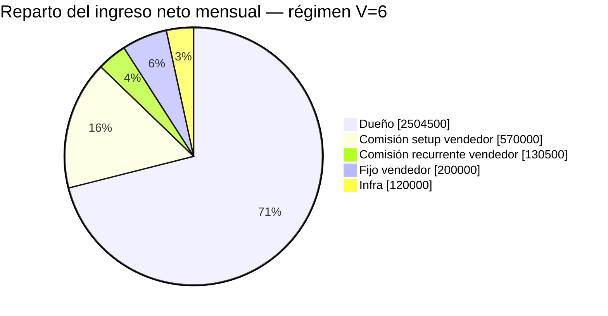

# LSP — Modelo de pago al vendedor y rentabilidad (Andes Vinotecas)

Unit economics del rol comercial con esquema **fijo + comisión escalonada (accelerator)**.
Responde dos preguntas:

1. ¿Cuánto gana el vendedor (OTE) con el esquema $200.000 fijo + comisión escalonada?
2. ¿En cuántos meses el negocio me deja **$1.500.000/mes a mí** (dueño)?

Enfoque steady-state (régimen) + rampa mes a mes desde cero. El piso de $1,5M/mes para el
dueño está **garantizado al mes 10 incluso en el peor volumen sostenido (4 ventas/mes)**.

---

## 1. Supuestos e inputs

Precios (`../../ejecutivo-de-cuentas/vinotecas/README.md`):

└─ Setup único: $190.000

└─ Mensual: $36.250

Neto de comisión Mercado Pago (6%):

└─ Setup neto: **$178.600**

└─ Mensual neto: **$34.075**

Estructura del vendedor (escalonada, ver §2):

└─ Fijo garantizado: **$200.000/mes**

└─ Recurrente: **flat 5%** del mensual (no escala con volumen)

└─ Setup escalonado: **25%** (<6) → **50%** (6–8) → **60%** (≥9 ventas/mes)

└─ OTE en régimen: **$477.000** (V=4) · **$900.500** (V=6) · **$1.421.750** (V=9)

Otros costos:

└─ Infra escalonada: **$70.000/mes** hasta 49 clientes; **$120.000/mes** desde 50
   clientes. Incluye $20.000/mes de teléfono fijo + ($50.000 → $100.000) de droplets,
   backups, etc.

└─ Costo variable por cliente: ≈ $0

Variables:

└─ **V** = ventas nuevas/mes (escenarios V=4 piso, V=6 medio y V=9 top)

└─ **L** = vida media del cliente en meses (sin dato real; ramp asume L ≥ 12)

---

## 2. Esquema de comisión escalonada (accelerator)

La comisión premia el cierre y se acelera al cruzar las cuotas de 6 y 9 ventas/mes. El
recurrente queda flat para no introducir volatilidad en el ingreso del vendedor ni en tu costo.

Sobre el monto facturado (bruto):

└─ **Recurrente (siempre):** 5% del mensual = **$1.812,50** por cliente activo/mes

└─ **Setup, <6 ventas/mes:** 25% = **$47.500** por cierre

└─ **Setup, 6–8 ventas/mes:** 50% = **$95.000** por cierre (retroactivo al mes que cruza 6)

└─ **Setup, ≥9 ventas/mes:** 60% = **$114.000** por cierre (retroactivo al mes que cruza 9)

**Por qué un tercer escalón en ≥9:** el piso del dueño lo fija el peor volumen (V=4), no el
alto. Con más ventas el colchón crece, así que un tier superior nunca toca tu $1,5M. Cada venta
extra es **rentable para el dueño** mientras el setup% < ~90% (el neto es 94% del bruto): a 60%
seguís reteniendo $64.600 netos del cierre + el recurrente. Premiar al hunter top no te cuesta
el piso.

**Por qué escalar setup y no recurrente en el tier alto:** el setup es pago único; el recurrente
es tu anualidad. Regalar recurrente erosiona margen para siempre; regalar más setup es un costo
acotado. Por eso el tope se queda en ~60% de setup y el recurrente nunca se mueve.

**Por qué escalonado y no un rate plano:** con 4 ventas/mes el piso del dueño obliga a que
el vendedor cobre ≤$507.400/mes total al mes 10. Un rate plano lo suficientemente generoso
para motivar rompería ese piso. El escalón es la **única** forma de ser generoso arriba
(cuando hay volumen que lo paga) sin arriesgar tu $1,5M abajo. Es práctica estándar de mercado
(quota accelerator / ramped commission).

**Por qué solo el setup escala:** escalonar también el recurrente haría que el vendedor cobre
25% sobre toda la base activa un mes y 5% al siguiente según las ventas del mes — ingreso
errático y costo tuyo impredecible. Escalando solo el cierre, motivás vender sin esa volatilidad.

**Trade-off de los cliffs (6 y 9):** los saltos retroactivos motivan fuerte pero pueden
incentivar *sandbagging* (guardar ventas para juntar el umbral el mes siguiente). El salto 5→6
casi triplica el setup ($237.500 → $570.000); el 8→9 lo lleva de $760.000 a $1.026.000. Con
tres escalones el riesgo crece. Si aparece, pasar a **marginal** (ventas 1–5 al 25%, 6ª–8ª al
50%, 9ª+ al 60% — sin salto retroactivo, mismo techo, suaviza el incentivo a guardar ventas).

---

## 3. LTV y equilibrio (referencia)

LTV neto por cliente = 178.600 + 34.075 × L:

└─ L = 6m: $383.050  ·  L = 12m: $587.500  ·  L = 24m: $996.400

El costo del vendedor **escala con las ventas** (comisión), así que no hay un piso fijo grande
que cubrir. El verdadero piso fijo es solo $200.000 + $70.000 = **$270.000/mes** (sube a
$320.000 al pasar 50 clientes por la infra).

**Nota sobre el fijo $200k:** recorte moderado frente a un $250k. Mejora tu downside ~$50k/mes
en meses flojos y sigue siendo base atractiva para contratar (≈40% del OTE a V=4, en rango de
mercado para roles comerciales). No bajar más sin un vendedor hunter probado.

---

## 4. Rampa mes a mes — tres escenarios

Sin churn en los primeros 12 meses. Base de clientes activos = V × mes.

### Escenario PISO — V=4 (tier bajo: setup 25%, recurrente 5%)

Base cruza 50 recién en el mes 13 → infra $70k todo el primer año.

└─ Ingreso neto(m) = $714.400 + $136.300 × m

└─ Comp vendedor(m) = $390.000 + $7.250 × m

└─ Ganancia dueño(m) = **$254.400 + $129.050 × m**

Valores clave:

└─ Mes 1 — dueño **$383.450** · vendedor $397.250

└─ Mes 6 — dueño **$1.028.700** · vendedor $433.500

└─ Mes 10 — dueño **$1.544.900** · vendedor $462.500 (cruza tu target)

└─ Mes 12 — dueño **$1.803.000** · vendedor $477.000 (régimen V=4)

### Escenario ESTIRADO — V=6 (tier medio: setup 50%, recurrente 5%)

Base cruza 50 en el mes 9 (base 54) → infra salta a $120k desde ahí.

└─ Ingreso neto(m) = $1.071.600 + $204.450 × m

└─ Comp vendedor(m) = $770.000 + $10.875 × m

└─ Ganancia dueño(m): meses 1–8 (infra $70k) **$231.600 + $193.575 × m**;
   meses 9–12 (infra $120k) **$181.600 + $193.575 × m**

Valores clave:

└─ Mes 6 — dueño **$1.393.050** · vendedor $835.250

└─ Mes 7 — dueño **$1.586.625** · vendedor $846.125 (cruza tu target, ¡3 meses antes!)

└─ Mes 9 — dueño **$1.923.775** · vendedor $867.875 (infra salta a $120k)

└─ Mes 12 — dueño **$2.504.500** · vendedor $900.500 (régimen V=6)

### Escenario TOP — V=9 (tier alto: setup 60%, recurrente 5%)

Base cruza 50 en el mes 6 (base 54) → infra salta a $120k desde ahí.

└─ Ingreso neto(m) = $1.607.400 + $306.675 × m

└─ Comp vendedor(m) = $1.226.000 + $16.312,5 × m

└─ Ganancia dueño(m): meses 1–5 (infra $70k) **$311.400 + $290.362,5 × m**;
   meses 6–12 (infra $120k) **$261.400 + $290.362,5 × m**

Valores clave:

└─ Mes 5 — dueño **$1.763.213** · vendedor $1.307.563 (cruza tu target, ¡5 meses antes!)

└─ Mes 6 — dueño **$2.003.575** · vendedor $1.323.875 (infra salta a $120k)

└─ Mes 10 — dueño **$3.165.025** · vendedor $1.389.125

└─ Mes 12 — dueño **$3.745.750** · vendedor $1.421.750 (régimen V=9)

### Ganancia del dueño por mes — los tres escenarios

Barras en orden V=4 (piso) · V=6 (medio) · V=9 (top); la línea es tu target $1,5M.

```mermaid
xychart-beta
    title "Ganancia del dueño — V=4 vs V=6 vs V=9 vs target $1.5M"
    x-axis "Mes" [1,2,3,4,5,6,7,8,9,10,11,12]
    y-axis "ARS/mes" 0 --> 3800000
    bar [383450,512500,641550,770600,899650,1028700,1157750,1286800,1415850,1544900,1673950,1803000]
    bar [425175,618750,812325,1005900,1199475,1393050,1586625,1780200,1923775,2117350,2310925,2504500]
    bar [601763,892125,1182488,1472850,1763213,2003575,2293938,2584300,2874663,3165025,3455388,3745750]
    line [1500000,1500000,1500000,1500000,1500000,1500000,1500000,1500000,1500000,1500000,1500000,1500000]
```

### Compensación del vendedor por mes — los tres escenarios

Barras en orden V=4 (piso) · V=6 (medio) · V=9 (top).

```mermaid
xychart-beta
    title "Comp vendedor — V=4 vs V=6 vs V=9"
    x-axis "Mes" [1,2,3,4,5,6,7,8,9,10,11,12]
    y-axis "ARS/mes" 0 --> 1500000
    bar [397250,404500,411750,419000,426250,433500,440750,448000,455250,462500,469750,477000]
    bar [780875,791750,802625,813500,824375,835250,846125,857000,867875,878750,889625,900500]
    bar [1242313,1258625,1274938,1291250,1307563,1323875,1340188,1356500,1372813,1389125,1405438,1421750]
```

---

## 5. ¿Llego a $1.500.000/mes para mí al mes 10?

Sí, **garantizado en el piso**. Con L ≥ 12:

└─ **V=4 (peor caso sostenido):** cruzás $1,5M en el **mes 10** ($1.544.900)

└─ **V=5 (tier bajo):** dueño mes 10 = **$1.948.625**

└─ **V=6 (tier medio):** cruzás en el **mes 7** ($1.586.625); mes 10 = **$2.117.350**

└─ **V=9 (tier alto):** cruzás en el **mes 5** ($1.763.213); mes 10 = **$3.165.025**

El escalón está calibrado para que el piso del dueño aguante en todo el rango V=4..9. Más
ventas = cruce más temprano y más ganancia, sin que el accelerator del vendedor lo coma.
El cuello de botella sigue siendo la **capacidad real de cerrar** — 4/mes garantiza tu meta
al mes 10, 6/mes la adelanta al mes 7, 9/mes al mes 5.

---

## 6. Reparto del ingreso neto en régimen (V=6)

De cada mes en régimen ($3.525.000 netos, base 72), el reparto:

El vendedor (fijo + comisión) se lleva ~26% del ingreso neto; el dueño retiene ~71%.

---

## 7. Sensibilidad a la vida del cliente

El plan **depende de que el cliente se quede ≥ 12 meses** para llegar al régimen pleno. En
régimen la base se estabiliza en V×L clientes. Ganancia del dueño en régimen:

Escenario V=4 (tier bajo): $254.400 + $129.050 × L − (ajuste infra si base ≥ 50)

└─ L = 12m: base 48 (<50 → infra $70k) → dueño **$1.803.000/mes** · vendedor $477.000

└─ L = 24m: base 96 (≥50 → infra $120k) → dueño **$3.301.600/mes** · vendedor $564.000

Escenario V=6 (tier medio): $301.600 + $193.575 × L − infra

└─ L = 12m: base 72 (≥50 → infra $120k) → dueño **$2.504.500/mes** · vendedor $900.500

└─ L = 24m: base 144 (≥50 → infra $120k) → dueño **$4.827.400/mes** · vendedor $1.031.000

Escenario V=9 (tier alto): $381.400 + $290.362,5 × L − infra

└─ L = 12m: base 108 (≥50 → infra $120k) → dueño **$3.745.750/mes** · vendedor $1.421.750

└─ L = 24m: base 216 (≥50 → infra $120k) → dueño **$7.230.100/mes** · vendedor $1.617.500

**Hallazgo:** incluso el peor escenario (V=4, L=12) deja al dueño en $1,8M — por encima del
target. El volumen bajo se compensa con un fijo y comisión recortados. Retener sigue rindiendo:
subir L de 12 a 24 casi duplica tu ganancia.

**Alerta sobre el vendedor:** con recurrente flat 5% el OTE no se dispara con la vida larga
(a L=24, V=6: ~$1,03M). El recurrente flat evita la inflación del OTE que provocaría un
recurrente alto (p. ej. 25%) sobre una base que crece año a año. El riesgo real es el opuesto: que con V=4 sostenido el OTE (~$477k) sea bajo y
cueste retener al vendedor — ahí conviene empujar volumen hacia el tier alto.

---

## 8. Conclusión

└─ **Esquema escalonado $200k fijo + 5% recurrente + setup 25%→50% (6 ventas) →60% (9 ventas).**
   OTE de $477k (V=4) a $1,42M (V=9). El dueño es rentable desde el mes 1.

└─ **Tu $1,5M/mes está garantizado al mes 10 incluso con solo 4 ventas/mes** ($1.544.900).
   Con 6 ventas lo cruzás en el mes 7.

└─ **En régimen el dueño retiene $1,8M (V=4), $2,5M (V=6) y $3,7M (V=9)** con L=12, todos por
   encima del objetivo.

└─ **El accelerator es la palanca clave:** premia llegar a 6 y 9 ventas sin arriesgar tu piso.
   El recurrente flat mantiene predecible el ingreso del vendedor y tu costo.

└─ **Vigilar:** sandbagging cerca de las cuotas de 6 y 9, y retención del vendedor si se estanca
   en V=4 (OTE bajo). El fijo $200k es palanca de contratación; el % de setup, de motivación.

└─ Rates (recurrente 5%, setup 25%/50%/60%, cuotas 6 y 9) y precios son perillas ajustables:
   ver §2 y §5.

> Targets y ratios del vendedor: `../../ejecutivo-de-cuentas/vinotecas/objetivos-ejecutivo.md`. Cobros y escalamiento: `../../ejecutivo-de-cuentas/vinotecas/proceso-interno.md`.
