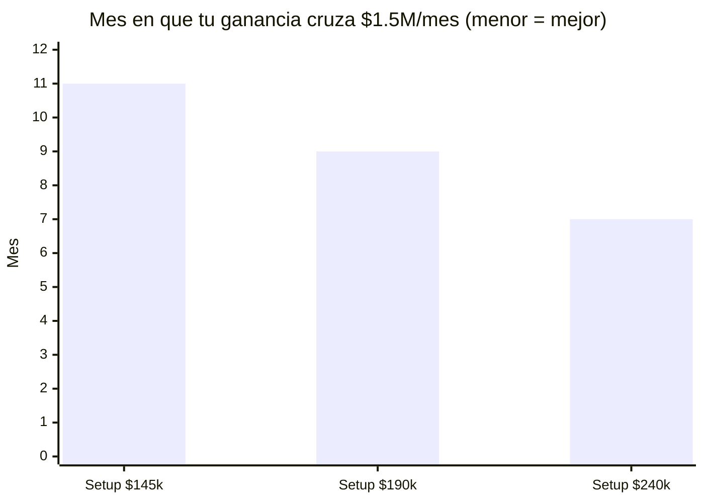
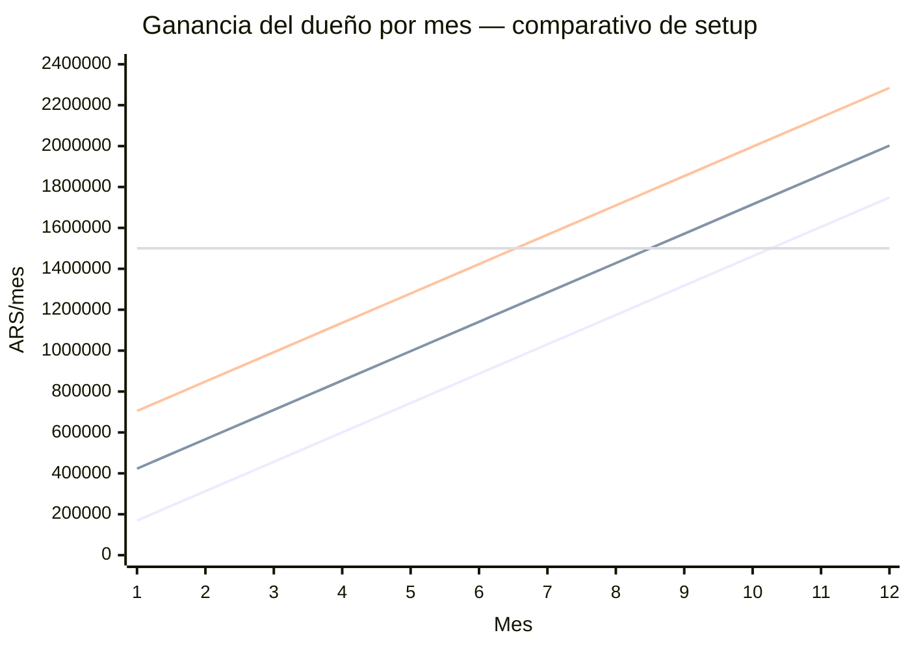

# LSP — Comparativo de modelos por precio de setup (Andes Vinotecas)

Compara cómo cambia **tu ganancia** y el **mes en que alcanzás $1.500.000/mes** según el
precio de setup, manteniendo todo lo demás igual al modelo base (`lsp-vendedor.md`).

Tres escenarios de setup:

└─ **Actual: $145.000**

└─ **Medio: $190.000**

└─ **Alto: $240.000**

---

## 1. Qué se mantiene fijo (igual al modelo base)

└─ Mensual: $36.250 (neto $34.075) — **no cambia entre escenarios**

└─ Target: **6 ventas/mes**

└─ Vida del cliente: L ≥ 12 meses (sin churn en la rampa)

└─ Infra: $20.000/mes

└─ Vendedor: **OTE $1.500.000 fijo en los tres escenarios**

└─ MP: 6%

**Decisión clave:** el vendedor cobra lo mismo en los tres modelos. La comisión de setup
se fija en **$87.000 por cierre** (en vez de un %) y la recurrente en **$10.150/cliente/mes**.
Así, **todo el aumento de setup queda para vos** — el comparativo mide cuánto te acerca
cada precio a tu objetivo de $1,5M/mes.

Setup neto por escenario (×0,94):

└─ $145.000 → **$136.300**

└─ $190.000 → **$178.600**

└─ $240.000 → **$225.600**

---

## 2. Fórmula de tu ganancia mensual

Misma pendiente en los tres (el recurrente no cambia); solo sube el punto de arranque:

Ganancia dueño(m) = $143.550 × m + intercepto

└─ Setup $145k: intercepto **$25.800**

└─ Setup $190k: intercepto **$279.600**

└─ Setup $240k: intercepto **$561.600**

Subir el setup desplaza toda la curva hacia arriba en paralelo.

---

## 3. Resultados comparados

Mes en que tu ganancia cruza **$1.500.000/mes**:

└─ Setup $145k → **mes 11**

└─ Setup $190k → **mes 9**

└─ Setup $240k → **mes 7**

Tu ganancia en el **mes 10**:

└─ Setup $145k → **$1.461.300** (todavía bajo target)

└─ Setup $190k → **$1.715.100**

└─ Setup $240k → **$1.997.100**

Tu ganancia en **régimen** (mes 12+, base 72 clientes):

└─ Setup $145k → **$1.748.400/mes**

└─ Setup $190k → **$2.002.200/mes**

└─ Setup $240k → **$2.284.200/mes**

Ingreso neto del negocio en régimen:

└─ Setup $145k → $3.271.200  ·  $190k → $3.525.000  ·  $240k → $3.807.000

---

## 4. Gráficos

### Mes en que alcanzás $1.5M/mes para vos

### Curva de ganancia del dueño — 3 escenarios

Líneas de abajo hacia arriba: **$145k**, **$190k**, **$240k**. La línea recta = target $1.5M.

---

## 5. Trade-offs (no solo números)

Subir el setup acelera tu objetivo, pero tiene costos cualitativos:

└─ **Conversión:** un setup más caro puede bajar la tasa de cierre. Si subir de $145k a
   $240k te hace caer de 6 a ~4,5 ventas/mes, el beneficio se diluye. El modelo asume 6
   ventas en los tres — validar que se sostiene al precio alto.

└─ **Posicionamiento:** el setup actual se vende como "promo 50% OFF de por vida"
   ($290k → $145k). Subir el precio choca con ese gancho comercial; habría que rearmar la
   narrativa de la oferta.

└─ **Objeciones:** `objeciones.md` ya trabaja el precio actual. Un setup mayor exige
   rebates nuevos.

---

## 6. Recomendación

└─ **$190.000 es el punto dulce:** te lleva a $1,5M/mes en el **mes 9** (dos meses antes
   que el actual) con un aumento de precio moderado (+31%) que probablemente no rompe la
   conversión. Régimen $2M/mes.

└─ **$240.000** es el más rentable (mes 7, régimen $2,28M) pero es el de mayor riesgo de
   conversión y el que más tensiona el posicionamiento de "promo".

└─ **$145.000 (actual)** es el más seguro para cerrar, pero te deja en el mes 11 — un mes
   tarde respecto a tu objetivo de mes 10.

└─ **Camino sugerido:** probar **$190k** con A/B real de conversión antes de comprometerse;
   si la tasa de cierre aguanta, evaluar $240k.

> Metodología completa, esquema de comisión y rampa detallada: `lsp-vendedor.md`.
> Precio y posicionamiento: `README.md`, `ficha-producto.md`. Rebates: `objeciones.md`.
