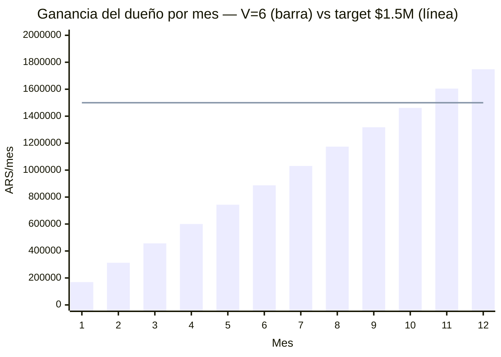
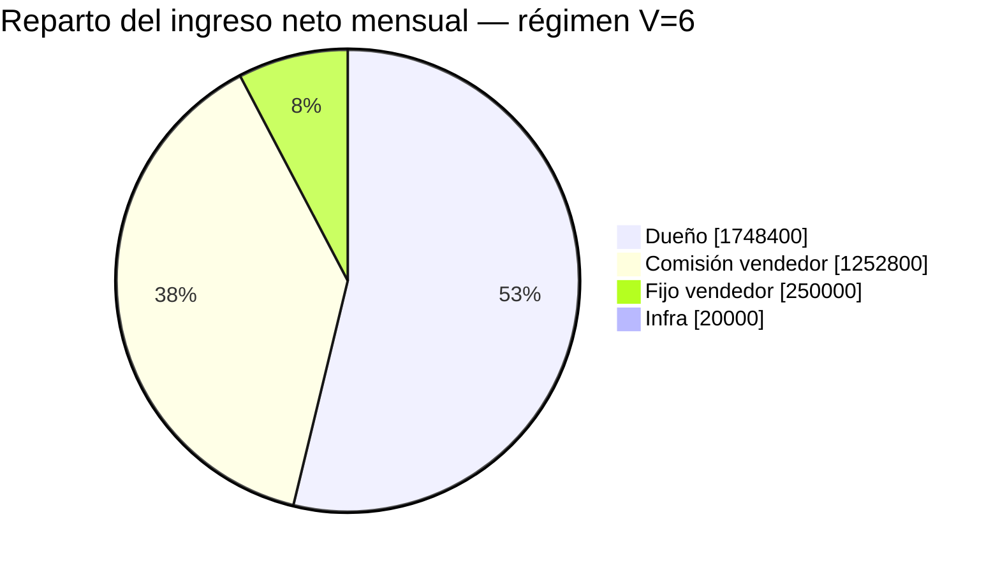

# LSP — Modelo de pago al vendedor y rentabilidad (Andes Vinotecas)

Unit economics del rol comercial con esquema **fijo + comisión**, target **6 ventas/mes**.
Responde dos preguntas:

1. ¿El esquema $250.000 fijo + comisión banca un OTE de $1.500.000 al vendedor?
2. ¿En cuántos meses el negocio me deja **$1.500.000/mes a mí** (dueño)?

Enfoque steady-state (régimen) + rampa mes a mes desde cero.

---

## 1. Supuestos e inputs

Precios (`README.md`, promo 50% OFF de por vida):

└─ Setup único: $145.000

└─ Mensual: $36.250

Neto de comisión Mercado Pago (6%):

└─ Setup neto: **$136.300**

└─ Mensual neto: **$34.075**

Estructura del vendedor:

└─ Fijo garantizado: **$250.000/mes**

└─ Comisión variable: % del setup + % del recurrente (ver §2)

└─ OTE (on-target earnings) a 6 ventas/mes en régimen: **~$1.500.000**

Otros costos:

└─ Infra (1 droplet, hostea varios clientes): **~$20.000/mes** fijo

└─ Costo variable por cliente: ≈ $0

Variables:

└─ **V** = ventas nuevas/mes = **6** (target fijo de este doc)

└─ **L** = vida media del cliente en meses (sin dato real; ramp asume L ≥ 12)

---

## 2. Esquema de comisión

Comisión sobre el monto **facturado** (bruto), pagada al vendedor:

└─ Por cierre nuevo: **60% del setup = $87.000**

└─ Por cliente activo, cada mes: **28% del mensual = $10.150**

Calibración a régimen (V=6, base 72 clientes activos):

└─ Comisión por setups: 6 × $87.000 = **$522.000/mes**

└─ Comisión por recurrente: 72 × $10.150 = **$730.800/mes**

└─ Variable total: **$1.252.800** + fijo $250.000 = **$1.502.800 ≈ OTE $1.5M** ✓

**Nota:** los porcentajes son altos (60% del setup) porque el precio de setup es bajo
frente a un OTE de $1,5M con solo 6 ventas. El recurrente (28%) premia retención: el
vendedor cobra mientras el cliente siga activo, alineando su interés con el churn bajo.
Subir el precio de setup permitiría bajar el % de comisión. Ambos % son perillas ajustables.

---

## 3. LTV y equilibrio (referencia)

LTV neto por cliente = 136.300 + 34.075 × L:

└─ L = 6m: $340.750  ·  L = 12m: $545.200  ·  L = 24m: $954.100

A diferencia del sueldo fijo puro, acá el costo del vendedor **escala con las ventas**
(comisión), así que no hay un piso fijo grande que cubrir: el negocio es rentable desde
volúmenes bajos. El verdadero piso fijo es solo $250.000 + $20.000 = **$270.000/mes**.

---

## 4. Rampa mes a mes (V = 6, L ≥ 12)

Sin churn en los primeros 12 meses. Base de clientes activos = 6 × mes.

Fórmulas:

└─ Ingreso neto(m) = $817.800 (setups) + $204.450 × m (recurrente acumulado)

└─ Comp vendedor(m) = $772.000 + $60.900 × m

└─ Ganancia dueño(m) = ingreso − comp − infra = **$143.550 × m + $25.800**

Valores clave:

└─ Mes 1 — dueño **$169.350** · vendedor $832.900

└─ Mes 4 — dueño **$600.000** · vendedor $1.015.600

└─ Mes 6 — dueño **$887.100** · vendedor $1.137.400

└─ Mes 8 — dueño **$1.174.200** · vendedor $1.259.200

└─ Mes 10 — dueño **$1.461.300** · vendedor $1.381.000

└─ Mes 11 — dueño **$1.604.850** · vendedor $1.441.900

└─ Mes 12 — dueño **$1.748.400** · vendedor $1.502.800 (régimen)

**Clave:** el dueño es rentable desde el mes 1 (no hace falta capital de trabajo grande,
a diferencia de un sueldo fijo de $1,5M que exigía ~$3-5M de colchón).

### Ganancia del dueño por mes

### Compensación del vendedor por mes

---

## 5. ¿Llego a $1.500.000/mes para mí al mes 10?

Casi. Con V = 6 exactas y L ≥ 12:

└─ Mes 10: dueño = **$1.461.300** (97% del objetivo)

└─ Cruzás los **$1.500.000 en el mes 11** ($1.604.850)

Para clavarlo en el mes 10 (faltan ~$38.700), tres palancas:

└─ Subir a **~6,3 ventas/mes** promedio (1 venta extra cada 3 meses)

└─ Subir el precio de setup (ej. de $145k a ~$160k acelera el cruce)

└─ Recortar levemente la comisión recurrente (28% → 25%)

El vendedor llega a su OTE de $1,5M recién en el mes 12 (en régimen). Antes cobra menos
porque el recurrente todavía no está acumulado — normal en un rol con comisión recurrente.

---

## 6. Reparto del ingreso neto en régimen (V=6)

De cada mes en régimen ($3.271.200 netos), el reparto:

El vendedor (fijo + comisión) se lleva ~46% del ingreso neto; el dueño retiene ~53%.

---

## 7. Sensibilidad a la vida del cliente

Todo el plan **depende de que el cliente se quede ≥ 12 meses**. Si churnea antes, la base
deja de crecer y tanto tu ganancia como el OTE del vendedor caen:

└─ L = 24m: base sigue creciendo hasta 144 activos → dueño en régimen muy por encima de $1,5M

└─ L = 12m: base se estabiliza en 72 → dueño $1.748.400/mes (escenario de este doc)

└─ L = 6m: churn arranca en el mes 7, base tope ~36 → dueño solo **~$887.000/mes** y
   vendedor **~$1.137.000** (ninguno llega al target)

**Acción:** medir la vida real del cliente apenas haya datos. Es la variable que define si
el modelo se cumple o se cae.

---

## 8. Conclusión

└─ **El esquema $250k fijo + comisión banca el OTE de $1,5M** del vendedor a 6 ventas/mes
   en régimen, sin fundir la caja: el dueño es rentable desde el mes 1.

└─ **Tu objetivo de $1,5M/mes se alcanza en el mes 11**, no el 10, con V=6 exactas.
   Un empujón mínimo (6,3 ventas/mes o +$15k de setup) lo adelanta al mes 10.

└─ **En régimen el dueño retiene ~$1.748.400/mes** (L=12m), por encima del objetivo.

└─ **Riesgo único real: el churn.** Con vida < 12m el modelo no se sostiene. Medirlo es
   prioridad uno.

└─ Comisión y precios son perillas ajustables: ver §2 y §5 para mover el punto donde
   alcanzás tu $1,5M.

> Targets y ratios del vendedor: `objetivos-vendedor.md`. Cobros y escalamiento: `proceso-interno.md`.
