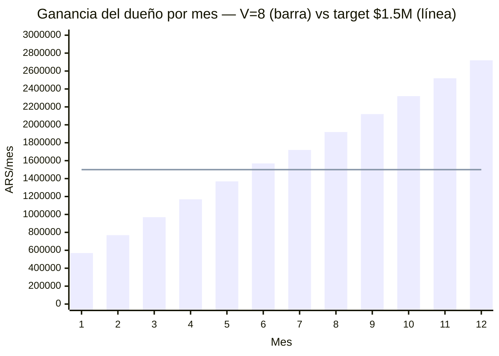
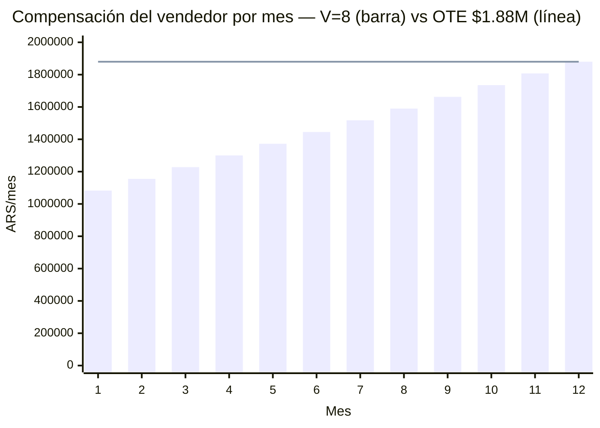
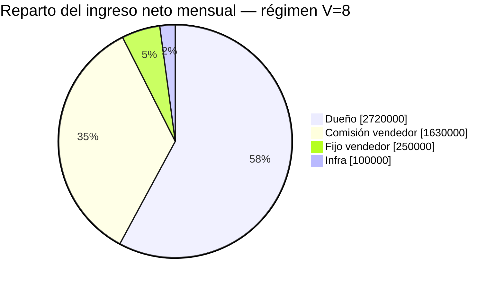

# LSP — Modelo de pago al vendedor y rentabilidad (Andes Vinotecas)

Unit economics del rol comercial con esquema **fijo + comisión**, target **8 ventas/mes**.
Responde dos preguntas:

1. ¿Cuánto gana el vendedor (OTE) con el esquema $250.000 fijo + comisión?
2. ¿En cuántos meses el negocio me deja **$1.500.000/mes a mí** (dueño)?

Enfoque steady-state (régimen) + rampa mes a mes desde cero.

---

## 1. Supuestos e inputs

Precios (`README.md`):

└─ Setup único: $190.000

└─ Mensual: $36.250

Neto de comisión Mercado Pago (6%):

└─ Setup neto: **$178.600**

└─ Mensual neto: **$34.075**

Estructura del vendedor:

└─ Fijo garantizado: **$250.000/mes**

└─ Comisión variable: **50% del setup + 25% del recurrente** (ver §2)

└─ OTE (on-target earnings) a 8 ventas/mes en régimen: **$1.880.000**

Otros costos:

└─ Infra escalonada: **$50.000/mes** hasta 49 clientes; **$100.000/mes** desde 50
   clientes (backups, droplets optimizados, etc.)

└─ Costo variable por cliente: ≈ $0

Variables:

└─ **V** = ventas nuevas/mes = **8** (target fijo de este doc)

└─ **L** = vida media del cliente en meses (sin dato real; ramp asume L ≥ 12)

---

## 2. Esquema de comisión

Comisión sobre el monto facturado (bruto), pagada al vendedor:

└─ Por cierre nuevo: **50% del setup = $95.000**

└─ Por cliente activo, cada mes: **25% del mensual = $9.062,50**

Calibración a régimen (V=8, base 96 clientes activos):

└─ Comisión por setups: 8 × $95.000 = **$760.000/mes**

└─ Comisión por recurrente: 96 × $9.062,50 = **$870.000/mes**

└─ Variable total: **$1.630.000** + fijo $250.000 = **OTE $1.880.000/mes**

**Nota:** el 50% del setup carga fuerte la comisión hacia el cierre (premia traer cliente
nuevo); el 25% recurrente premia retención. Con 8 ventas/mes el OTE del vendedor sube a
~$1,88M — bien por encima de un piso de $1,5M. Ambos % son perillas ajustables: si querés
bajar el OTE del vendedor, recortá el % de setup.

---

## 3. LTV y equilibrio (referencia)

LTV neto por cliente = 178.600 + 34.075 × L:

└─ L = 6m: $383.050  ·  L = 12m: $587.500  ·  L = 24m: $996.400

A diferencia del sueldo fijo puro, acá el costo del vendedor **escala con las ventas**
(comisión), así que no hay un piso fijo grande que cubrir: el negocio es rentable desde
volúmenes bajos. El verdadero piso fijo es solo $250.000 + $50.000 = **$300.000/mes** (sube
a $350.000 al pasar 50 clientes por la infra).

---

## 4. Rampa mes a mes (V = 8, L ≥ 12)

Sin churn en los primeros 12 meses. Base de clientes activos = 8 × mes. La base cruza 50
en el **mes 7** (base 56), así que la infra sube de $50.000 a $100.000/mes a partir de ahí.

Fórmulas:

└─ Ingreso neto(m) = $1.428.800 (setups) + $272.600 × m (recurrente acumulado)

└─ Comp vendedor(m) = $1.010.000 + $72.500 × m

└─ Ganancia dueño(m) = ingreso − comp − infra:

   ├─ Meses 1–6 (infra $50k): **$200.100 × m + $368.800**

   └─ Meses 7–12 (infra $100k): **$200.100 × m + $318.800**

Valores clave:

└─ Mes 1 — dueño **$568.900** · vendedor $1.082.500

└─ Mes 4 — dueño **$1.169.200** · vendedor $1.300.000

└─ Mes 6 — dueño **$1.569.400** · vendedor $1.445.000 (cruza tu target)

└─ Mes 7 — dueño **$1.719.500** · vendedor $1.517.500 (infra salta a $100k)

└─ Mes 8 — dueño **$1.919.600** · vendedor $1.590.000

└─ Mes 10 — dueño **$2.319.800** · vendedor $1.735.000

└─ Mes 12 — dueño **$2.720.000** · vendedor $1.880.000 (régimen)

**Clave:** el dueño es rentable desde el mes 1 (no hace falta capital de trabajo grande,
a diferencia de un sueldo fijo de $1,5M que exigía ~$3-5M de colchón).

### Ganancia del dueño por mes

### Compensación del vendedor por mes

---

## 5. ¿Llego a $1.500.000/mes para mí al mes 10?

Sí, holgado. Con V = 8 y L ≥ 12:

└─ Cruzás los **$1.500.000 en el mes 6** ($1.569.400) — cuatro meses antes de tu objetivo

└─ Mes 10: dueño = **$2.319.800** (155% del objetivo)

El 50% de comisión sobre el setup hace que el vendedor arranque cobrando fuerte ($1,08M ya
en el mes 1) y retrasa un poco tu cruce frente a un % de setup menor — pero con 8 ventas/mes
igual llegás al mes 6. El cuello de botella es la **capacidad real del vendedor de cerrar 8/mes**.

---

## 6. Reparto del ingreso neto en régimen (V=8)

De cada mes en régimen ($4.700.000 netos, base 96), el reparto:

El vendedor (fijo + comisión) se lleva ~40% del ingreso neto; el dueño retiene ~58%.

---

## 7. Sensibilidad a la vida del cliente

El plan **depende de que el cliente se quede ≥ 12 meses** para llegar al régimen pleno. Si
churnea antes, la base deja de crecer. En régimen la base se estabiliza en 8×L clientes y
la ganancia del dueño es (descontando la infra según el escalón de la base):

Ganancia régimen = $418.800 + $200.100 × L − infra

└─ L = 24m: base crece hasta 192 activos (≥50 → infra $100.000) → dueño **$5.121.200/mes**

└─ L = 12m: base se estabiliza en 96 (≥50 → infra $100.000) → dueño **$2.720.000/mes**
   (escenario de este doc)

└─ L = 6m: churn arranca en el mes 7, base tope ~48 (<50 → infra $50.000) → dueño
   **$1.569.400/mes** y vendedor **~$1.445.000**

**Salto de infra:** la base pasa 50 clientes en el mes 7, así que casi todos los escenarios
(L≥7) pagan $100.000/mes de infra. Solo si la vida es muy corta (L=6, base tope 48) te
quedás en $50.000. El salto resta $50.000/mes — marginal frente a la ganancia.

**Hallazgo:** con 8 ventas/mes incluso L=6 supera tu target de $1,5M ($1.569.400). El
volumen compensa la vida corta. Aun así, retener rinde: subir L de 6 a 12 suma
~$1.150.000/mes al dueño.

**Alerta sobre el vendedor:** a L=24 la comisión recurrente lleva el OTE del vendedor a
~$2.750.000/mes (cobra $9.062,50 por cada uno de 192 clientes activos), más el 50% de setup
que ya pesa fuerte desde el arranque. Si la vida resulta larga, conviene topar la comisión
o convertir parte en bono único.

---

## 8. Conclusión

└─ **El esquema $250k fijo + 50%/25% de comisión da un OTE de ~$1,88M** al vendedor a
   8 ventas/mes en régimen, sin fundir la caja: el dueño es rentable desde el mes 1.

└─ **Tu objetivo de $1,5M/mes se alcanza en el mes 6**, por delante de tu meta, con V=8.

└─ **En régimen el dueño retiene $2.720.000/mes** (L=12m, infra $100k), casi el doble del objetivo.

└─ **La infra ($50k → $100k al pasar 50 clientes) casi no mueve la aguja:** $50.000/mes
   extra es marginal frente a una ganancia de $2,7-5M. No es palanca de decisión.

└─ **El cuello de botella pasa a ser el cierre:** el modelo banca 8 ventas/mes, la pregunta
   es si el vendedor las sostiene. El 50% de setup lo incentiva a cazar clientes nuevos.

└─ Comisión (50% setup / 25% recurrente) y precios son perillas ajustables: ver §2 y §5.

> Targets y ratios del vendedor: `objetivos-vendedor.md`. Cobros y escalamiento: `proceso-interno.md`.
