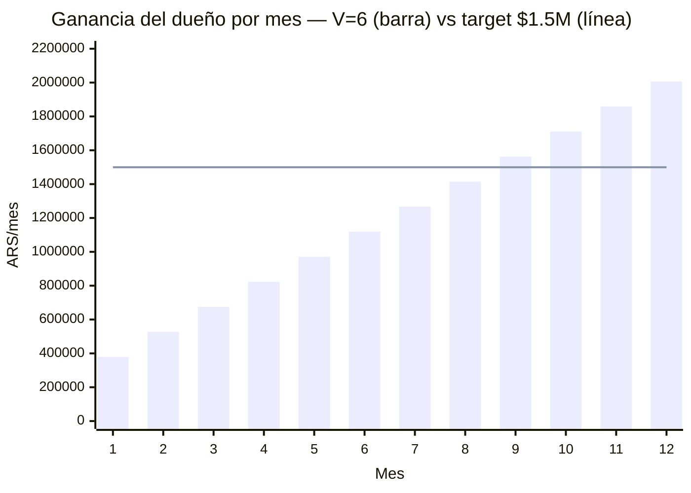
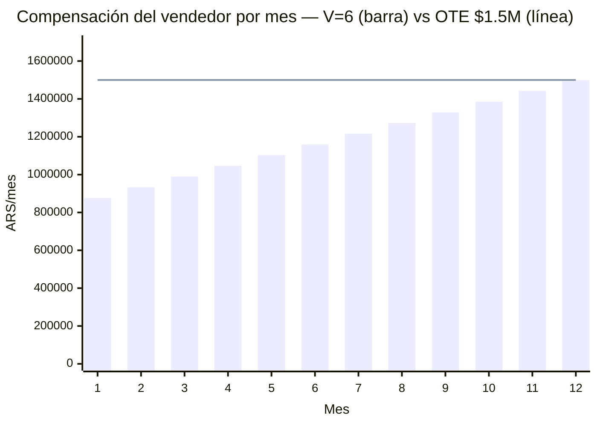
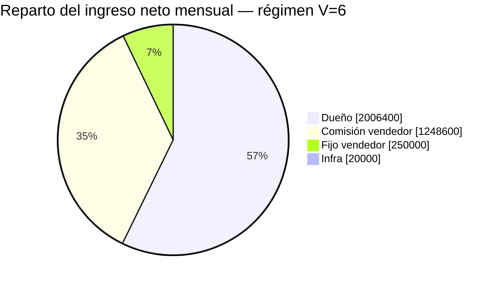

# LSP — Modelo de pago al vendedor y rentabilidad (Andes Vinotecas)

Unit economics del rol comercial con esquema **fijo + comisión**, target **6 ventas/mes**.
Responde dos preguntas:

1. ¿El esquema $250.000 fijo + comisión banca un OTE de $1.500.000 al vendedor?
2. ¿En cuántos meses el negocio me deja **$1.500.000/mes a mí** (dueño)?

Enfoque steady-state (régimen) + rampa mes a mes desde cero.

---

## 1. Supuestos e inputs

Precios (`README.md`):

└─ Setup único: $190.000

└─ Mensual: $36.250

Neto de comisión Mercado Pago (6%):

└─ Setup neto: **$178.600**

└─ Mensual neto: **$34.075**

Estructura del vendedor:

└─ Fijo garantizado: **$250.000/mes**

└─ Comisión variable: % del setup + % del recurrente (ver §2)

└─ OTE (on-target earnings) a 6 ventas/mes en régimen: **~$1.500.000**

Otros costos:

└─ Infra (1 droplet, hostea varios clientes): **~$20.000/mes** fijo

└─ Costo variable por cliente: ≈ $0

Variables:

└─ **V** = ventas nuevas/mes = **6** (target fijo de este doc)

└─ **L** = vida media del cliente en meses (sin dato real; ramp asume L ≥ 12)

---

## 2. Esquema de comisión

Comisión sobre el monto **facturado** (bruto), en porcentajes redondos:

└─ Por cierre nuevo: **50% del setup = $95.000**

└─ Por cliente activo, cada mes: **26% del mensual = $9.425**

Calibración a régimen (V=6, base 72 clientes activos):

└─ Comisión por setups: 6 × $95.000 = **$570.000/mes**

└─ Comisión por recurrente: 72 × $9.425 = **$678.600/mes**

└─ Variable total: **$1.248.600** + fijo $250.000 = **$1.498.600 ≈ OTE $1,5M** ✓

**Nota:** el 50% del setup es alto porque el precio de setup, aunque sea $190k, sigue siendo
bajo frente a un OTE de $1,5M con solo 6 ventas. El recurrente (26%) premia retención: el
vendedor cobra mientras el cliente siga activo, alineando su interés con el churn bajo.
Ambos % son perillas ajustables: subir el setup permite bajarlos.

---

## 3. LTV y equilibrio (referencia)

LTV neto por cliente = 178.600 + 34.075 × L:

└─ L = 6m: $383.050  ·  L = 12m: $587.500  ·  L = 24m: $996.400

A diferencia del sueldo fijo puro, acá el costo del vendedor **escala con las ventas**
(comisión), así que no hay un piso fijo grande que cubrir: el negocio es rentable desde
volúmenes bajos. El verdadero piso fijo es solo $250.000 + $20.000 = **$270.000/mes**.

---

## 4. Rampa mes a mes (V = 6, L ≥ 12)

Sin churn en los primeros 12 meses. Base de clientes activos = 6 × mes.

Fórmulas:

└─ Ingreso neto(m) = $1.071.600 (setups) + $204.450 × m (recurrente acumulado)

└─ Comp vendedor(m) = $820.000 + $56.550 × m

└─ Ganancia dueño(m) = ingreso − comp − infra = **$147.900 × m + $231.600**

Valores clave:

└─ Mes 1 — dueño **$379.500** · vendedor $876.550

└─ Mes 4 — dueño **$823.200** · vendedor $1.046.200

└─ Mes 6 — dueño **$1.119.000** · vendedor $1.159.300

└─ Mes 8 — dueño **$1.414.800** · vendedor $1.272.400

└─ Mes 9 — dueño **$1.562.700** · vendedor $1.328.950 (cruza tu target)

└─ Mes 10 — dueño **$1.710.600** · vendedor $1.385.500

└─ Mes 12 — dueño **$2.006.400** · vendedor $1.498.600 (régimen)

**Clave:** el dueño es rentable desde el mes 1 (no hace falta capital de trabajo grande,
a diferencia de un sueldo fijo de $1,5M que exigía ~$3-5M de colchón).

### Ganancia del dueño por mes

### Compensación del vendedor por mes

---

## 5. ¿Llego a $1.500.000/mes para mí al mes 10?

Sí, y con margen. Con V = 6 exactas y L ≥ 12:

└─ Cruzás los **$1.500.000 en el mes 9** ($1.562.700) — un mes antes de tu objetivo

└─ Mes 10: dueño = **$1.710.600** (114% del objetivo)

El salto frente al setup viejo de $145k (que cruzaba recién en el mes 11) viene de subir
el setup a $190k manteniendo el OTE del vendedor fijo: todo el aumento de precio queda para vos.

El vendedor llega a su OTE de $1,5M recién en el mes 12 (en régimen). Antes cobra menos
porque el recurrente todavía no está acumulado — normal en un rol con comisión recurrente.

---

## 6. Reparto del ingreso neto en régimen (V=6)

De cada mes en régimen ($3.525.000 netos), el reparto:

El vendedor (fijo + comisión) se lleva ~43% del ingreso neto; el dueño retiene ~57%.

---

## 7. Sensibilidad a la vida del cliente

Todo el plan **depende de que el cliente se quede ≥ 12 meses**. Si churnea antes, la base
deja de crecer y tanto tu ganancia como el OTE del vendedor caen. En régimen la base se
estabiliza en 6×L clientes y la ganancia del dueño es:

Ganancia régimen = $231.600 + $147.900 × L

└─ L = 24m: base sigue creciendo hasta 144 activos → dueño **$3.781.200/mes**

└─ L = 12m: base se estabiliza en 72 → dueño **$2.006.400/mes** (escenario de este doc)

└─ L = 6m: churn arranca en el mes 7, base tope ~36 → dueño solo **$1.119.000/mes** y
   vendedor **~$1.159.300** (ninguno llega al target)

**Acción:** medir la vida real del cliente apenas haya datos. Es la variable que define si
el modelo se cumple o se cae. Retener pesa más que el precio: subir L de 6 a 12 suma
~$887k/mes al dueño.

**Alerta sobre el vendedor:** a L=24 la comisión recurrente acumulada lleva el OTE del
vendedor a ~$1.607.200/mes (cobra $9.425 por cada uno de 144 clientes activos). Si la vida
resulta larga, conviene topar la comisión recurrente o convertir parte en bono único.

---

## 8. Conclusión

└─ **El esquema $250k fijo + comisión banca el OTE de $1,5M** del vendedor a 6 ventas/mes
   en régimen, sin fundir la caja: el dueño es rentable desde el mes 1.

└─ **Tu objetivo de $1,5M/mes se alcanza en el mes 9**, un mes antes de tu meta, con V=6
   exactas — gracias al setup de $190k.

└─ **En régimen el dueño retiene ~$2.006.400/mes** (L=12m), bien por encima del objetivo.

└─ **Riesgo único real: el churn.** Con vida < 12m el modelo no se sostiene. Medirlo es
   prioridad uno.

└─ Comisión (50% setup / 26% recurrente) y precios son perillas ajustables: ver §2 y §5.

> Targets y ratios del vendedor: `objetivos-vendedor.md`. Cobros y escalamiento: `proceso-interno.md`.
